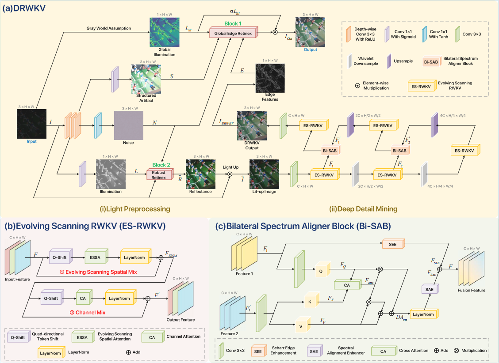

<h1 align="center">DRWKV: Focusing on Object Edges for Low-Light Image Enhancement</h1>
<div align="center">
🖼️This papers has been submitted to WACV 2026🖼️
</div>
<div align="center">
  <hr>
  Xuecheng Bai<sup>1, *</sup>&nbsp;
  Yuxiang Wang<sup>2, *</sup>&nbsp;
  Boyu Hu<sup>3</sup>&nbsp;
  Qinyuan Jie<sup>1</sup>&nbsp;
  Chuanzhi Xu<sup>2, †</sup>&nbsp;
  Hongru Xiao<sup>4</sup>&nbsp;
  Kechen Li<sup>5</sup>&nbsp;
  Vera Chung<sup>2</sup>&nbsp;
  <br>
  <sup>1</sup> Shenyang Ligong University&nbsp; <sup>2</sup> The University of Sydney <br>
  <sup>3</sup> University of International Business and Economic <br>
  <sup>4</sup> Tongji University&nbsp; 
  <sup>5</sup> Nanjing University of Aeronautics and Astronautics <br>
  <sup>*</sup> Equal contribution &nbsp;&nbsp;<sup>†</sup> Corresponding author<br>

  <h4>
    <a href="https://arxiv.org/pdf/2507.18594">📄 arXiv Paper</a> &nbsp; 
  </h4>
</div>

<blockquote>
<b>Abstract:</b> <i>Low-light image enhancement remains a challenging
task, particularly in preserving object edge continuity and fine
structural details under extreme illumination degradation. In this
paper, we propose a novel model, DRWKV (Detailed Receptance
Weighted Key Value), which integrates our proposed Global
Edge Retinex (GER) theory, enabling effective decoupling of
illumination and edge structures for enhanced edge fidelity.
Secondly, we introduce Evolving WKV Attention, a spiral-
scanning mechanism that captures spatial edge continuity and
models irregular structures more effectively. Thirdly, we design
the Bilateral Spectrum Aligner (Bi-SAB) and a tailored MS²-Loss
to jointly align luminance and chrominance features, improving
visual naturalness and mitigating artifacts. Extensive experiments
on five LLIE benchmarks demonstrate that DRWKV achieves
leading performance in PSNR, SSIM, and NIQE while main-
taining low computational complexity. Furthermore, DRWKV
enhances downstream performance in low-light multi-object
tracking tasks, validating its generalization capabilities.</i>
</blockquote>

<p align="center">
  
</p>

---
### Preparation

### Train

### Contact

If you have any questions, please contact Chuanzhi Xu or Xuecheng Bai by e-mail (xhuanzhi.xu@sydney.edu.au; bai_xuecheng@163.com).

### Citation

If you find the code helpful in your research or work, please cite the following paper:

```
@misc{bai2025drwkvfocusingobjectedges,
      title={DRWKV: Focusing on Object Edges for Low-Light Image Enhancement}, 
      author={Xuecheng Bai and Yuxiang Wang and Boyu Hu and Qinyuan Jie and Chuanzhi Xu and Hongru Xiao and Kechen Li and Vera Chung},
      year={2025},
      eprint={2507.18594},
      archivePrefix={arXiv},
      primaryClass={cs.CV},
      url={https://arxiv.org/abs/2507.18594}, 
}
```
### License

This repository is released under the Apache 2.0 license as found in the [LICENSE]() file.

### Acknowledgement

URWKV is built with reference to the code of the following projects: [RWKV](https://github.com/BlinkDL/RWKV-LM), [Vision-RWKV](https://github.com/OpenGVLab/Vision-RWKV), [RetinexMamba](https://github.com/YhuoyuH/RetinexMamba) and [Retinexformer](https://github.com/caiyuanhao1998/Retinexformer). Thanks for their awesome work!